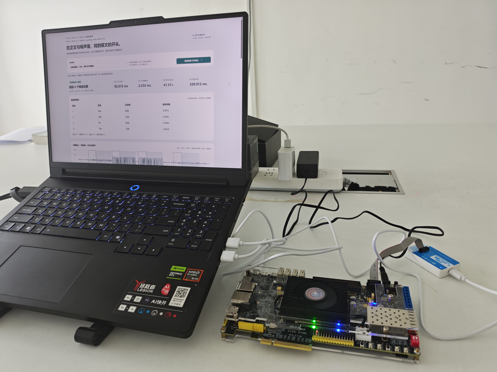
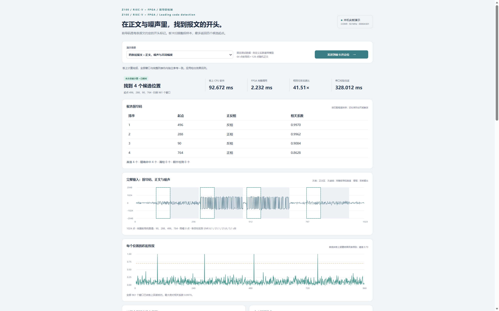

# RISC-V 前导码检测加速系统

系统基于正点原子 Z100（XC7Z100-2），由 PicoRV32 软核与 FPGA 检测模块组成。PicoRV32 负责控制和软件参考计算，FPGA 完成归一化相关与最多四个目标定位，电脑负责输入生成和结果显示。硬件版本为 0000A501，PL 工作频率为 50 MHz，开发工具为 Vivado 2023.1。系统使用板载接口、USB 线和电脑。

应用测试使用预先冻结的 1704 个数据块：核心组的 1200 个前导码全部精确定位，1000 个常规非目标块无误报；弱信号、相似序列等边界测试结果见设计报告。同一四报文输入的板内完整调用为 2.23240 ms，相对同板软件加速约 41.51 倍，串口往返时间另计。当前实现处理合成基带数据，不含射频采样和连续跨块解码。

## 文档

- 设计报告：[PDF](report/design_report.pdf)、[Word](report/design_report.docx)，包含系统设计、实物照片、运行截图和测试结果。
- 系统图与数据流图：[Visio 源文件](report/figures/system_diagrams.vsdx)。
- [复现步骤](report/reproduction.md)与[测试数据索引](report/evidence_index.md)。
- [技术协作记录](report/ai_records/readme.md)与[可复用核验工具](skill/readme.md)。

## 实物与演示





其余照片与截图见 [图片目录](board/photos/readme.md)。

[下载源码与材料](https://github.com/Askeladdzn/riscv_preamble_z100/releases/latest/download/riscv_preamble_z100_source.zip) · [下载演示视频](https://github.com/Askeladdzn/riscv_preamble_z100/releases/latest/download/demo_video.mp4)

演示视频为 MP4/H.264，时长 2 分 41.7 秒，保留完整操作和原音轨。

## 离线核验

通过 Code → Download ZIP 下载，或使用以下命令克隆，以保留文件原始换行：

```powershell
git clone -c core.autocrlf=false https://github.com/Askeladdzn/riscv_preamble_z100.git
```

在项目根目录运行：

```powershell
python -m pip install -r src/host/requirements.txt
python -B -X utf8 sim/verify_submission.py
```

脚本检查文件哈希、原始串口响应、参考结果、性能统计和文档，最后输出 `PASS: compact submission replay`。此命令不连接板卡。请保留文件原始字节，避免自动换行转换影响 SHA256；运行时不要使用 Python `-O`。

## 构建与演示

按[复现步骤](report/reproduction.md)配置 Python、Vivado 和 xPack GCC，在工作副本中编译固件、运行仿真并生成 bitstream。

接好原配电源、JTAG 下载器和 PL_UART J20 后，可下载随包提供的 bitstream：

```powershell
$vivado = 'E:\Xilinx\Vivado\2023.1\bin\vivado.bat'
& $vivado -mode batch -source build/program_riscv.tcl -tclargs 0000a501
python -B -X utf8 src/host/serve_application_preamble.py --port COM9 --http-port 8767
```

将 Vivado 路径和串口号改为本机实际配置，在电脑上打开 http://127.0.0.1:8767/ ，选择场景并发送到板卡。页面分别显示输入预览和本次板卡计算结果。当前程序不写入 Flash，断电后需要重新下载。

## 目录

```text
riscv_preamble_z100/
  readme.md
  src/       # RTL、固件、电脑程序及第三方 CPU
  sim/       # 测试台、仿真记录与核验脚本
  build/     # 构建与下载脚本、固件、bitstream、实现报告
  board/     # 引脚约束、实物照片与原始板测记录
  data/      # 冻结输入与参考输出
  skill/     # 软硬件结果核验工具
  report/    # 设计报告、系统图、技术协作与接口说明
```

当前文件清单及 SHA256 见 `report/package_manifest.json`。V1/A3/A4 数据用于性能对照，A5 数据包含主测试批次与两次恢复测试。

## 许可证

项目自有部分采用 [MIT 许可证](report/reference/license_mit.txt)。PicoRV32 保留原 ISC 许可证，详细来源见[第三方说明](report/reference/third_party_notices.md)。
